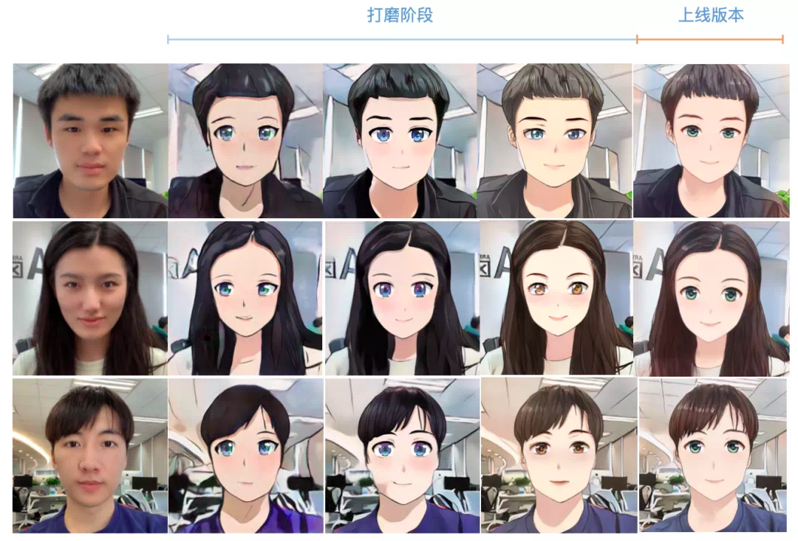

# AI-nime

Neural Transfer Style ANIME 

Goal of This Project use Neural Style Transfer to animify photo

 *[Ilustration1](https://miro.medium.com/max/700/1*GklOp6fJTreugVI_janZvA.png)*

# ROADMAP

- [x] Literature Review (In Progress)

- [ ] Simple / Sample Working Code (Maybe From Other Github Project)

- [ ] Dataset Collection, Labelling, and Preprocessing 

- [ ] Build Neural Nework Model 

- [ ] etc..

# Paper Reference

* Universal Style Transfer via Feature Transform [[1].](https://arxiv.org/abs/1705.08086)

* Stylizing Video by Example [[2].](https://dcgi.fel.cvut.cz/home/sykorad/Jamriska19-SIG.pdf)

* Artistic Style Transfre for Videos [[3].](https://arxiv.org/abs/1604.08610)

* Interactive Video Stylization Using Few-Shot Patch-Based Training [[4].](https://ondrejtexler.github.io/res/Texler20-SIG_patch-based_training_main.pdf)

* 

# Implementation

* 
